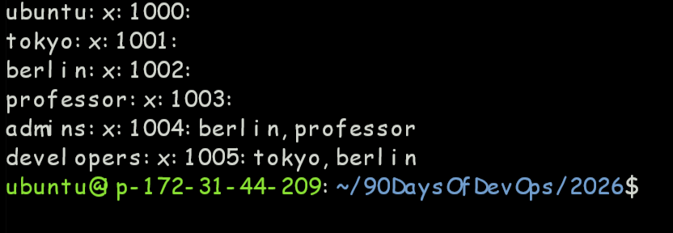
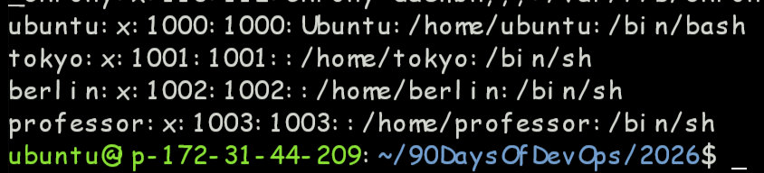
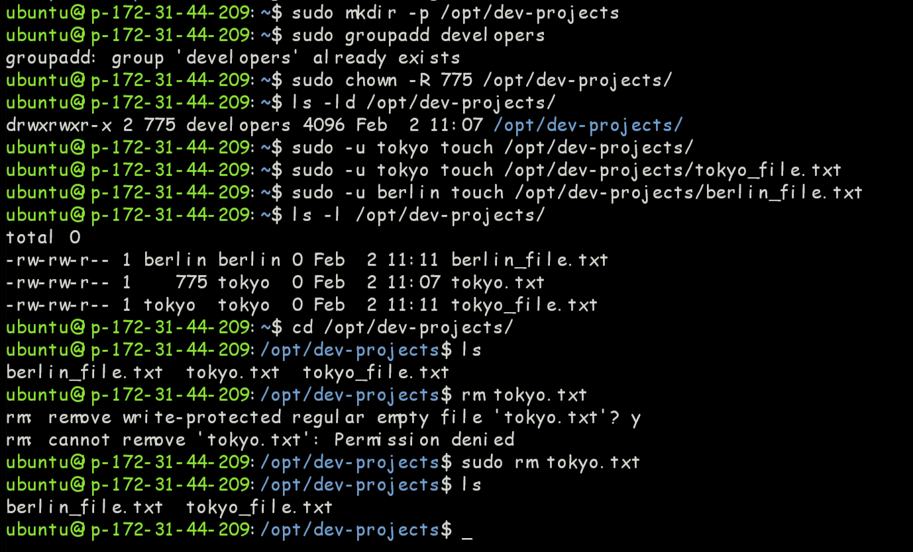
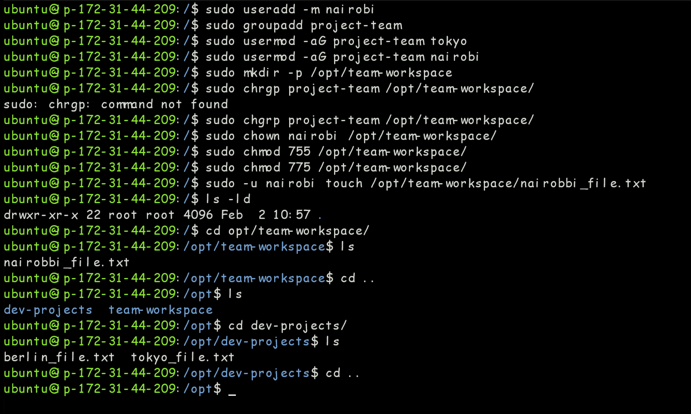
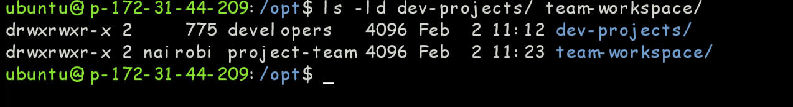
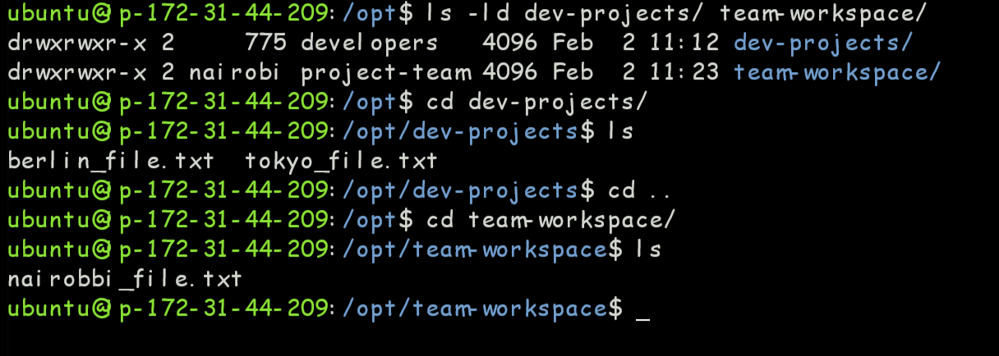
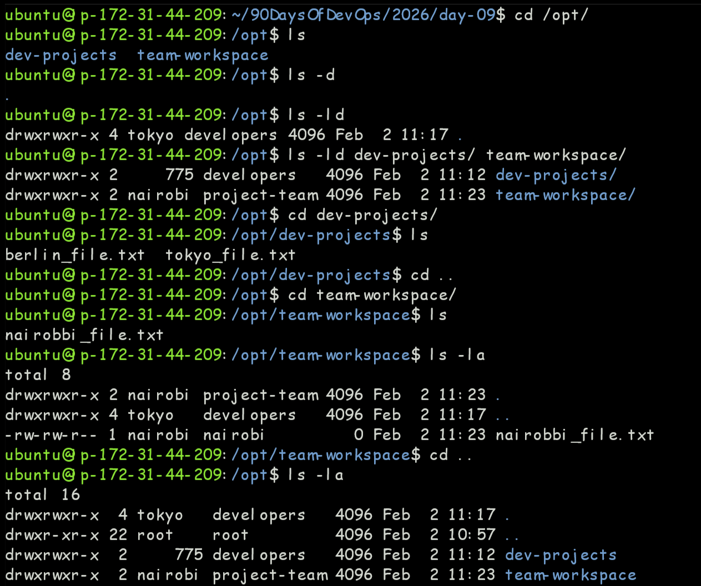
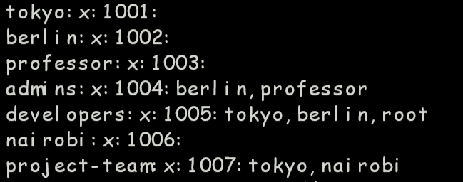
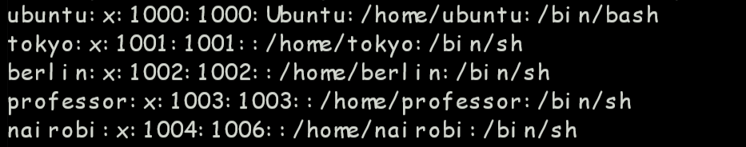

# Day 9 — Linux – Users, Permissions & Process Management

> **Challenge:** #90DaysOfDevOps | **Day:** 9 / 90

---

## Summary

Hands-on implementation and practical learning for **Users & Groups**. --- - README.md - Screenshot 2026-02-02 160041.png - Screenshot 2026-02-02 160131.png 

---

## Topic

**Linux – Users, Permissions & Process Management**

---

## Last Commit

| Field   | Value |
|---------|-------|
| **Hash**    | `ec6ef21` |
| **Date**    | 2026-02-02 18:10 |
| **Author**  | PrakharSrivastava01 |
| **Message** | Add files via upload |

---

## Notes & Documentation

| File | Category |
|------|----------|
| `DAY-09.md` | Markdown Notes |
| `README.md` | Markdown Notes |
| `day-09-user-management.md` | Markdown Notes |

---

## Screenshots

### `Screenshot 2026-02-02 160041.png`

### `Screenshot 2026-02-02 160131.png`

### `Screenshot 2026-02-02 164300.png`

### `Screenshot 2026-02-02 165351.png`

### `Screenshot 2026-02-02 172647.png`

### `Screenshot 2026-02-02 172705.png`

### `Screenshot 2026-02-02 172733.png`

### `Screenshot 2026-02-02 172751.png`

### `Screenshot 2026-02-02 172819.png`

---

## Key Learnings

- [ ] Add your key takeaways here
- [ ] Concepts understood
- [ ] Commands / tools practised
- [ ] Challenges faced & solved

---

## References

- [90DaysOfDevOps Repo](https://github.com/Heyyprakhar1/90DaysOfDevOps/tree/daily-assignment)
- [TrainWithShubham](https://www.trainwithshubham.com/)

---

*Generated by `generate_daywise.sh` on 2026-02-24 08:20:27*
