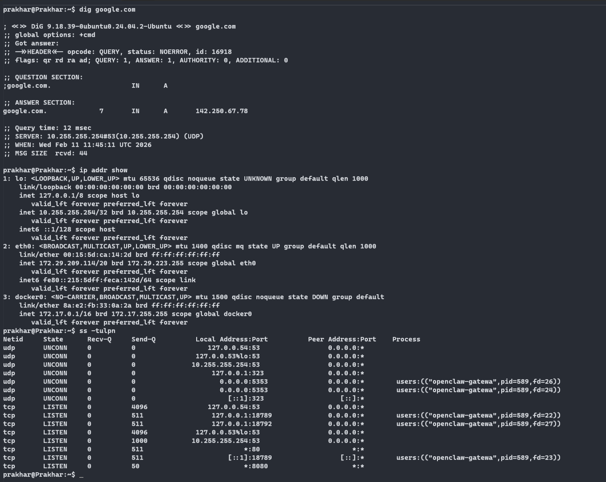

# Day 15 — Shell Scripting & Automation

> **Challenge:** #90DaysOfDevOps | **Day:** 15 / 90

---

## Summary

Hands-on implementation and practical learning for **DNS & Ports**. --- - README.md - Screenshot 2026-02-11 171545.png - day-15-networking-concepts.md 

---

## Topic

**Shell Scripting & Automation**

---

## Last Commit

| Field   | Value |
|---------|-------|
| **Hash**    | `55ed105` |
| **Date**    | 2026-02-11 17:19 |
| **Author**  | Prakhar |
| **Message** | d-15 |

---

## Notes & Documentation

| File | Category |
|------|----------|
| `DAY-15.md` | Markdown Notes |
| `README.md` | Markdown Notes |
| `day-15-networking-concepts.md` | Markdown Notes |

---

## Screenshots

### `Screenshot 2026-02-11 171545.png`

---

## Key Learnings

- [ ] Add your key takeaways here
- [ ] Concepts understood
- [ ] Commands / tools practised
- [ ] Challenges faced & solved

---

## References

- [90DaysOfDevOps Repo](https://github.com/Heyyprakhar1/90DaysOfDevOps/tree/daily-assignment)
- [TrainWithShubham](https://www.trainwithshubham.com/)

---

*Generated by `generate_daywise.sh` on 2026-02-24 08:20:27*
