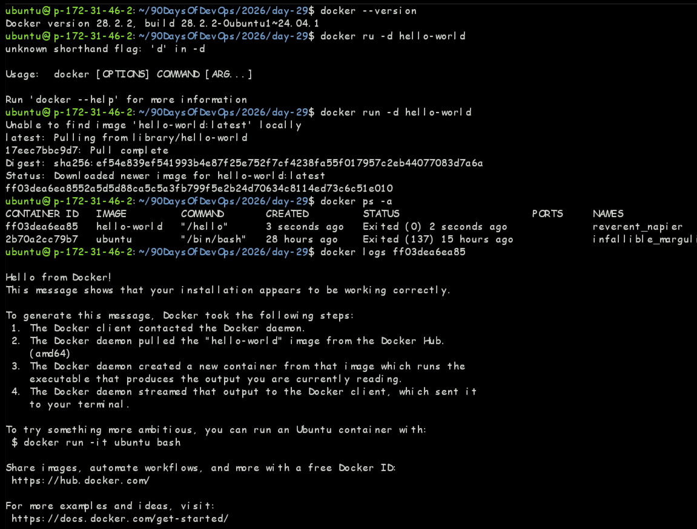
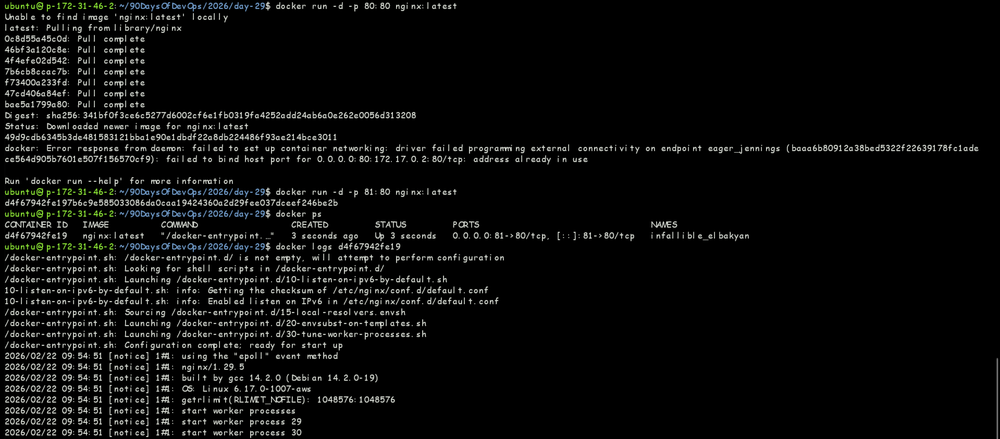
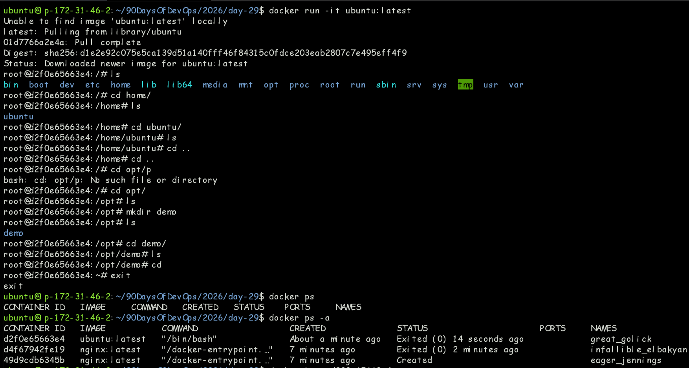
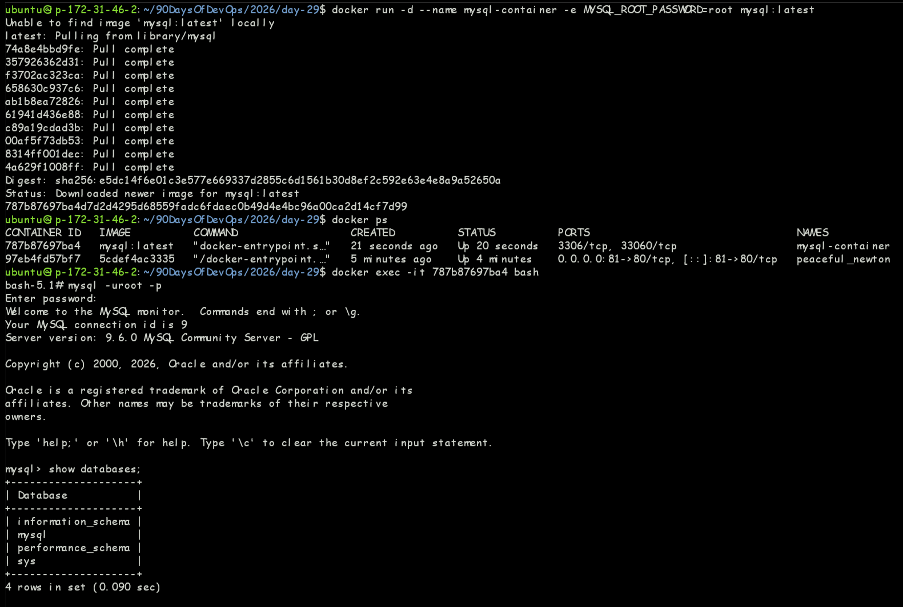
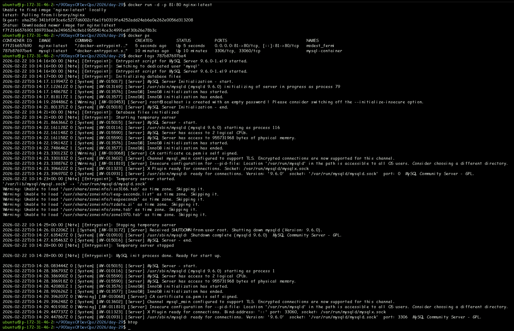

# Day 29 — Docker & Containerisation

> **Challenge:** #90DaysOfDevOps | **Day:** 29 / 90

---

## Summary

Hands-on implementation and practical learning for **Docker Basics**. --- - README.md - Screenshots - day-29-docker-basics.md 

---

## Topic

**Docker & Containerisation**

---

## Last Commit

| Field   | Value |
|---------|-------|
| **Hash**    | `9fc6b08` |
| **Date**    | 2026-02-22 16:36 |
| **Author**  | Prakhar |
| **Message** | Screenshots added for day-29 |

---

## Notes & Documentation

| File | Category |
|------|----------|
| `DAY-29.md` | Markdown Notes |
| `README.md` | Markdown Notes |
| `day-29-docker-basics.md` | Markdown Notes |

---

## Screenshots

### `Screenshots/Screenshot 2026-02-22 152845.png`

### `Screenshots/Screenshot 2026-02-22 152905.png`

### `Screenshots/Screenshot 2026-02-22 153605.png`

### `Screenshots/Screenshot 2026-02-22 155256.png`

### `Screenshots/Screenshot 2026-02-22 155631.png`

---

## Key Learnings

- [ ] Add your key takeaways here
- [ ] Concepts understood
- [ ] Commands / tools practised
- [ ] Challenges faced & solved

---

## References

- [90DaysOfDevOps Repo](https://github.com/Heyyprakhar1/90DaysOfDevOps/tree/daily-assignment)
- [TrainWithShubham](https://www.trainwithshubham.com/)

---

*Generated by `generate_daywise.sh` on 2026-02-24 08:20:28*
