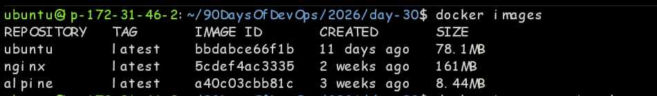
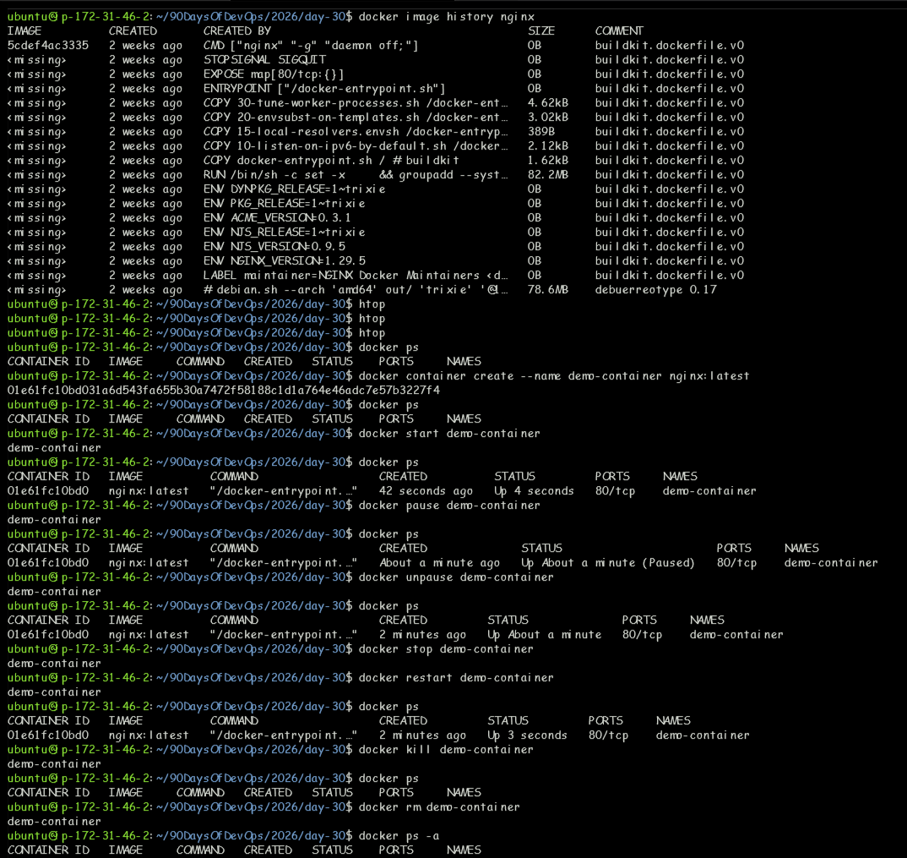
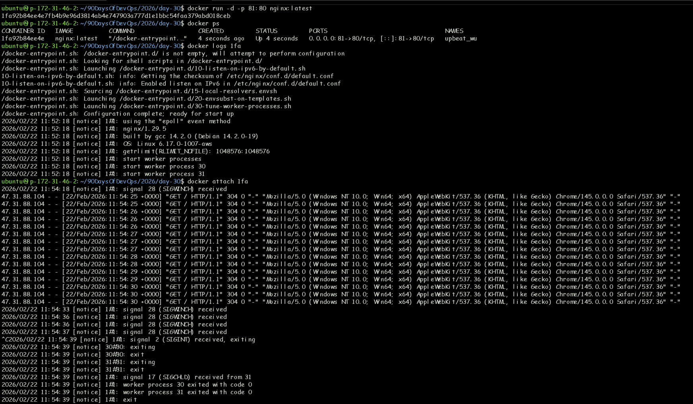
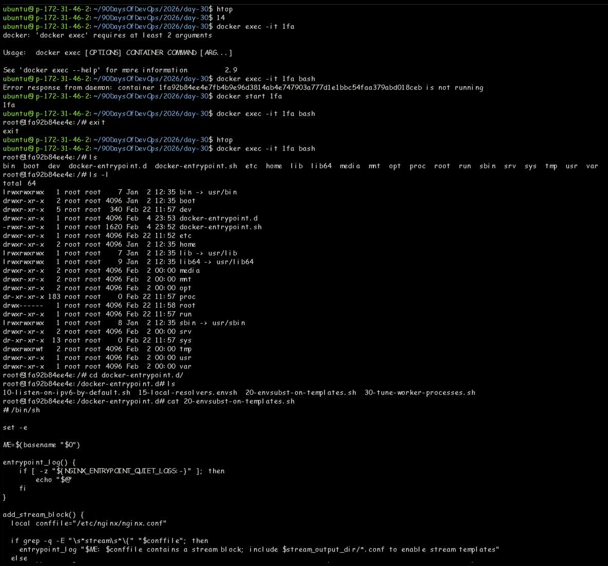
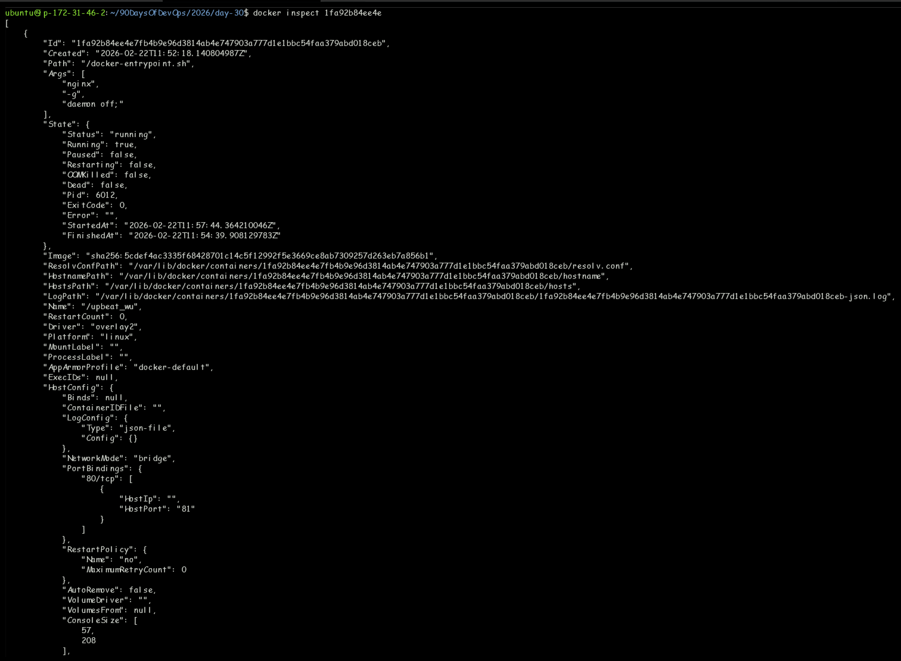
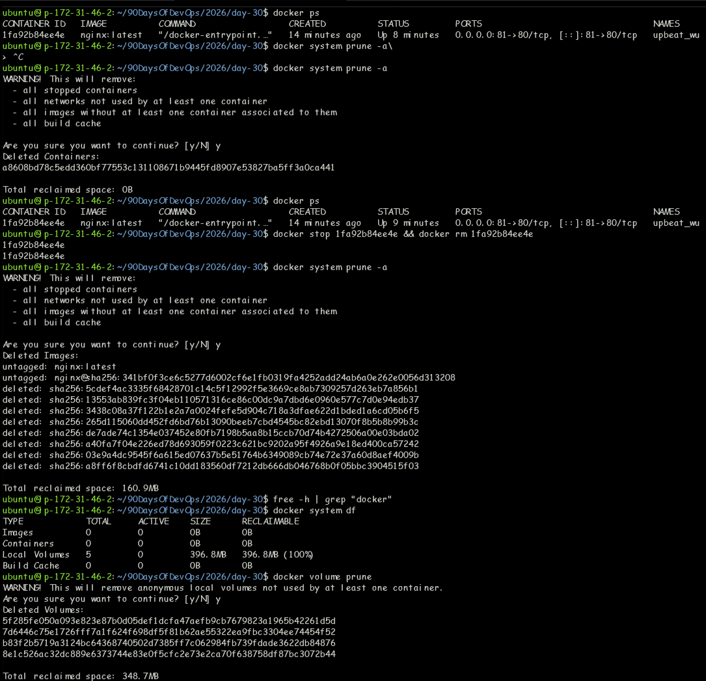
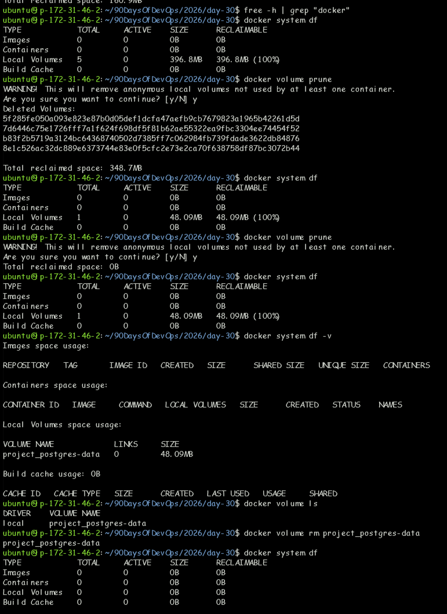

# Day 30 — Docker & Containerisation

> **Challenge:** #90DaysOfDevOps | **Day:** 30 / 90

---

## Summary

Hands-on implementation and practical learning for **Docker Images & Containers**. --- - README.md - Screenshots - day-30-images.md 

---

## Topic

**Docker & Containerisation**

---

## Last Commit

| Field   | Value |
|---------|-------|
| **Hash**    | `dff6e45` |
| **Date**    | 2026-02-22 18:04 |
| **Author**  | Prakhar |
| **Message** | Readme & Screenshots are attached |

---

## Notes & Documentation

| File | Category |
|------|----------|
| `DAY-30.md` | Markdown Notes |
| `README.md` | Markdown Notes |
| `day-30-images.md` | Markdown Notes |

---

## Screenshots

### `Screenshots/Screenshot 2026-02-22 165854.png`

### `Screenshots/Screenshot 2026-02-22 172403.png`

### `Screenshots/Screenshot 2026-02-22 172455.png`

### `Screenshots/Screenshot 2026-02-22 173121.png`

### `Screenshots/Screenshot 2026-02-22 173614.png`

### `Screenshots/Screenshot 2026-02-22 174050.png`

### `Screenshots/Screenshot 2026-02-22 180101.png`

---

## Key Learnings

- [ ] Add your key takeaways here
- [ ] Concepts understood
- [ ] Commands / tools practised
- [ ] Challenges faced & solved

---

## References

- [90DaysOfDevOps Repo](https://github.com/Heyyprakhar1/90DaysOfDevOps/tree/daily-assignment)
- [TrainWithShubham](https://www.trainwithshubham.com/)

---

*Generated by `generate_daywise.sh` on 2026-02-24 08:20:28*
